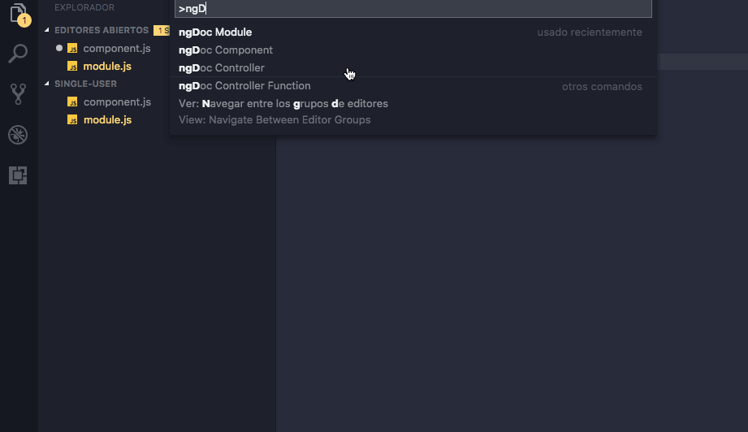
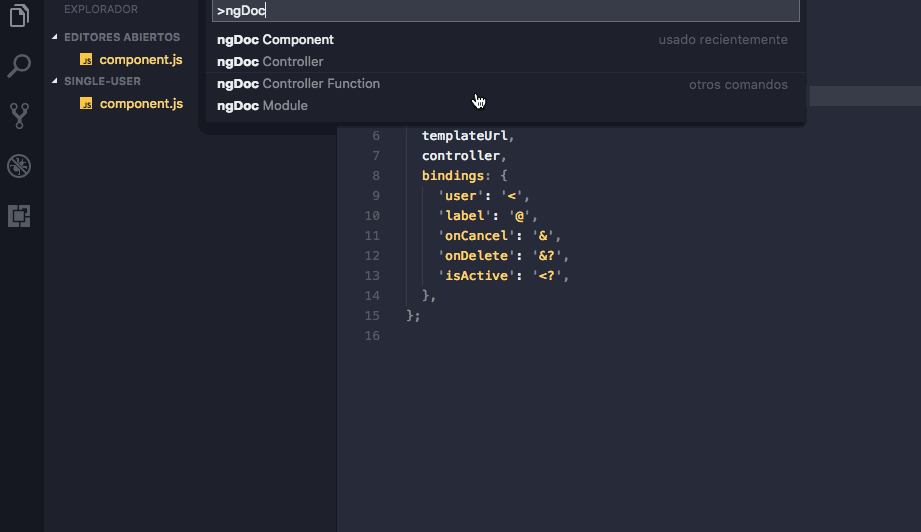
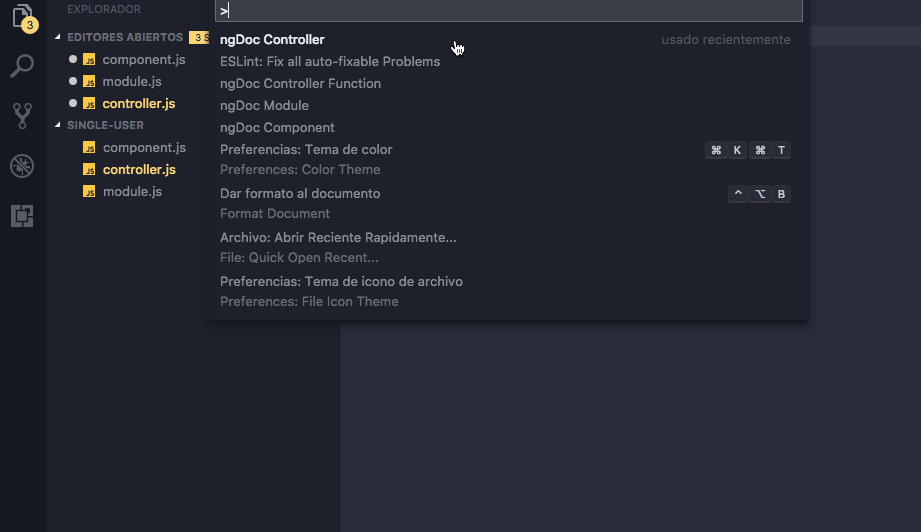
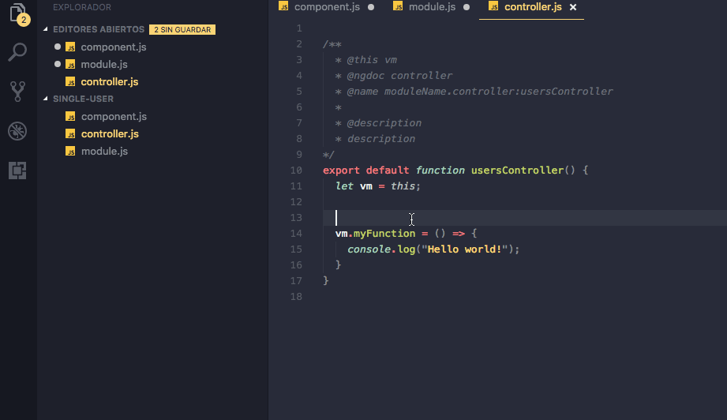
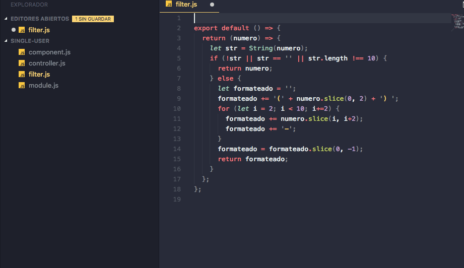
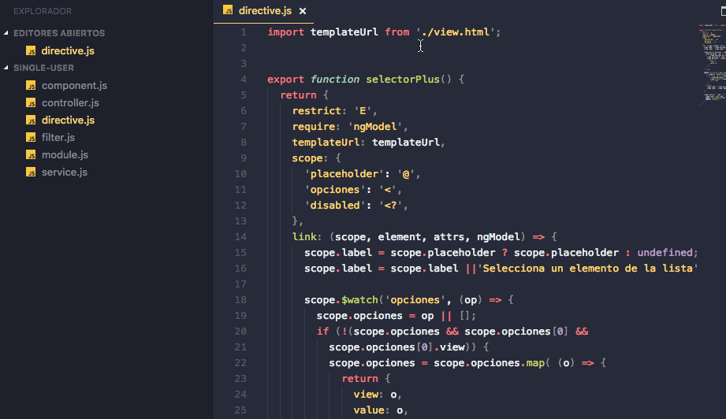
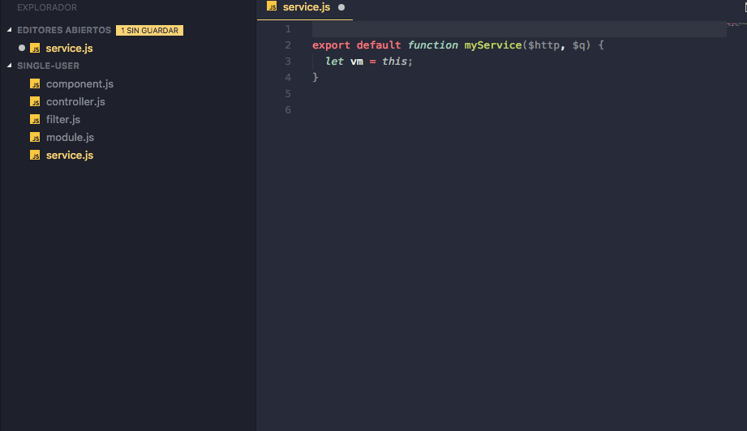

# AngularJS ngDoc - VSCode Extension

 
  

Generate ngDoc comments for:
* Modules
* Components
* Controllers
* Controller Functions
* Directives 
* Filters
* Services

## Features
## Module

* WORKING:
    * [x] Default ngDoc generated
---
## Component

  
  * WORKING:
    * [x] Default ngDoc generated
    * [x] Automatic component name detection from file folder name "my-component" => "myComponent"
    * [x] Automatic bindings name detection
    * [x] Automatic binding type detection
  * TODO:
    * [ ] Automatic module name detection
---
## Controller 

  
  * WORKING:
    * [x] Default ngDoc generated
    * [x] Automatic controller name detection
  * TODO:
    * [ ] Automatic function params detection
    * [ ] Anonymous arrow function (ES6)
---
## Controller Function

  
  * WORKING:
    * [x] Default ngDoc generated
  * TODO:
    * [ ] Automatic function name detection
    * [ ] Automatic function params detection
    * [ ] Automatic function return detection
---
## Filter

  
  * WORKING
    * [x] Default ngDoc generated
  * TODO:
    * [ ] Automatic filter name detection
    * [ ] Automatic module name detection
    * [ ] Automatic filter params detection
    * [ ] Automatic filter return detection

---
* [ ] Directive

 * WORKING
    * [x] Default ngDoc generated
    * [x] Automatic directive name detection
    * [x] Automatic scope detection
    * [x] Automatic restrict detection
    * [x] Automatic module name detection (from folder name).

---
## Service  

  * WORKING
    * [x] Default ngDoc generated
  * TODO:
    * [ ] Automatic imports required
    * [ ] Automatic service name detection
    
---
* [ ] Provider

---

**Enjoy!**
